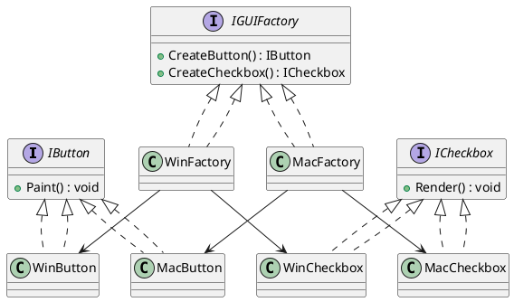
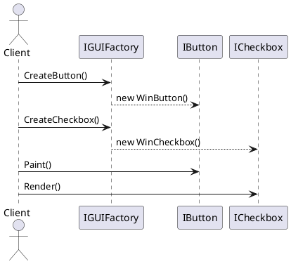

# 🏭 Abstract Factory (Абстрактная фабрика)

## 🧩 Уникальное название

**Abstract Factory (Абстрактная фабрика)**
Иногда называют: *Kit Factory* или *Фабрика фабрик*

---

## 🧠 Описание решаемой проблемы

### 🔍 Проблема

Необходимо создавать **целые семейства взаимосвязанных объектов**,
но при этом **не зависеть от конкретных классов этих объектов**.

То есть — вы хотите создавать объекты, **которые должны работать вместе**,
но хотите иметь возможность **легко менять их семейство (вариант)** без изменения клиентского кода.

---

### 💬 Примеры задач

1. 💻 **Интерфейс приложения под разные ОС:**
   Нужно создавать элементы GUI (кнопки, окна, меню) в стиле Windows, macOS или Linux.
   Важно, чтобы "WindowsButton" работала с "WindowsCheckbox", а не с macOS-компонентом.

2. 🎮 **Игровой движок:**
   Разные игровые миры используют разные типы персонажей, оружия и транспорта.
   Каждое "семейство" объектов должно быть совместимо внутри себя.

3. 🧱 **Система хранения данных:**
   Один вариант — SQL база (SqlConnection, SqlCommand), другой — NoSQL (MongoConnection, MongoCommand).
   Клиенту не нужно знать, какой конкретно тип используется.

---

## 🏗️ Описание способа решения

1. Определяется **интерфейс фабрики**, который объявляет методы для создания всех продуктов семейства.
2. Для каждого варианта семейства создаётся **конкретная фабрика**, реализующая интерфейс и возвращающая нужные реализации продуктов.
3. Клиент работает только с **абстрактной фабрикой** и **абстрактными продуктами**, не зная, какие конкретные классы создаются.

> Таким образом, меняя фабрику, мы меняем целое семейство создаваемых объектов.

---

## 📊 Диаграмма и способ реализации

### UML (PlantUML) — структура классов



---

### UML (PlantUML) — последовательность использования



---

## 💻 Реализация на C#

### 1️⃣ Абстрактные продукты

```csharp
public interface IButton
{
    void Paint();
}

public interface ICheckbox
{
    void Render();
}
```

---

### 2️⃣ Конкретные продукты (Windows и Mac)

```csharp
public class WinButton : IButton
{
    public void Paint() => Console.WriteLine("Рисуем кнопку в стиле Windows");
}

public class WinCheckbox : ICheckbox
{
    public void Render() => Console.WriteLine("Рисуем чекбокс в стиле Windows");
}

public class MacButton : IButton
{
    public void Paint() => Console.WriteLine("Рисуем кнопку в стиле macOS");
}

public class MacCheckbox : ICheckbox
{
    public void Render() => Console.WriteLine("Рисуем чекбокс в стиле macOS");
}
```

---

### 3️⃣ Абстрактная фабрика

```csharp
public interface IGUIFactory
{
    IButton CreateButton();
    ICheckbox CreateCheckbox();
}
```

---

### 4️⃣ Конкретные фабрики

```csharp
public class WinFactory : IGUIFactory
{
    public IButton CreateButton() => new WinButton();
    public ICheckbox CreateCheckbox() => new WinCheckbox();
}

public class MacFactory : IGUIFactory
{
    public IButton CreateButton() => new MacButton();
    public ICheckbox CreateCheckbox() => new MacCheckbox();
}
```

---

### 5️⃣ Клиентский код

```csharp
public class Application
{
    private readonly IButton _button;
    private readonly ICheckbox _checkbox;

    public Application(IGUIFactory factory)
    {
        _button = factory.CreateButton();
        _checkbox = factory.CreateCheckbox();
    }

    public void RenderUI()
    {
        _button.Paint();
        _checkbox.Render();
    }
}

public static class Program
{
    public static void Main(string[] args)
    {
        IGUIFactory factory;

        string os = "Windows"; // может определяться автоматически
        if (os == "Windows")
            factory = new WinFactory();
        else
            factory = new MacFactory();

        var app = new Application(factory);
        app.RenderUI();
    }
}
```

**Результат:**

```
Рисуем кнопку в стиле Windows
Рисуем чекбокс в стиле Windows
```

---

## ⚖️ Плюсы и минусы, области применения, примеры

### ✅ Плюсы

| Плюс                             | Описание                                                        |
| -------------------------------- | --------------------------------------------------------------- |
| 🔹 Изоляция конкретных классов   | Клиент не знает, какие именно классы используются               |
| 🔹 Лёгкая смена семейств         | Просто подменяем фабрику — и всё семейство компонентов меняется |
| 🔹 Гарантия совместимости        | Все объекты одного семейства корректно работают вместе          |
| 🔹 Принцип открытости/закрытости | Новые семейства можно добавлять без изменения клиентского кода  |

---

### ❌ Минусы

| Минус                                    | Описание                                                    |
| ---------------------------------------- | ----------------------------------------------------------- |
| ⚙️ Усложнение структуры                  | Требуется множество классов (фабрики, продукты, интерфейсы) |
| 🧩 Трудно добавлять новые типы продуктов | Нужно менять интерфейс фабрики и все конкретные реализации  |

---

### 💡 Области применения

* Когда система должна работать с **несколькими семействами объектов**, но только **одно семейство используется одновременно**.
* Когда требуется **гарантировать совместимость объектов** из одного семейства.
* Когда система должна быть легко **расширяема новыми вариантами семейств**.

---

### 🧱 Примеры из реальных систем

| Сфера    | Пример                                                                |
| -------- | --------------------------------------------------------------------- |
| GUI      | Разные темы (Windows, macOS, Linux)                                   |
| Игры     | Разные миры: `FantasyFactory`, `SciFiFactory`                         |
| СУБД     | `SqlFactory`, `MongoFactory`                                          |
| Принтеры | `LaserFactory`, `InkjetFactory`                                       |
| Автопром | `ToyotaFactory` → `Sedan`, `SUV`; `TeslaFactory` → `Model3`, `ModelX` |

---

## 🔍 Сравнение с Factory Method

| Критерий          | Factory Method                     | Abstract Factory                               |
| ----------------- | ---------------------------------- | ---------------------------------------------- |
| Что создаёт       | Один тип продукта                  | Семейство продуктов                            |
| Где используется  | В иерархии классов                 | В составе нескольких связанных объектов        |
| Способ расширения | Через подклассы                    | Через добавление новых фабрик                  |
| Пример            | `DocumentFactory.CreateDocument()` | `GUIFactory.CreateButton() / CreateCheckbox()` |

---

## 🧭 Вывод

**Abstract Factory** — мощный паттерн, обеспечивающий создание **целых семейств взаимосвязанных объектов** без привязки к конкретным классам.

Он идеально подходит, когда нужно:

* поддерживать несколько взаимозаменяемых семейств продуктов;
* гарантировать, что компоненты из одного семейства совместимы;
* обеспечить лёгкую смену "вариантов" без переписывания кода.

Но его не стоит применять в простых проектах — он усложняет архитектуру и увеличивает количество классов.
