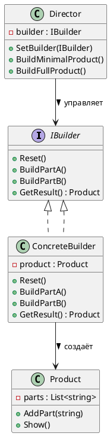
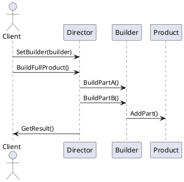

# 🧱 Builder (Строитель)

## 🧩 Уникальное название

**Builder (Строитель)**
Также известен как: *Пошаговый конструктор*, *Паттерн пошагового построения*.

---

## 🧠 Описание решаемой проблемы

### 🔍 Проблема

Иногда объект:

* имеет **много параметров** (в том числе необязательных),
* требует **сложной логики создания** или **последовательности шагов**,
* или существует **несколько различных способов построения** (вариации одного продукта).

Если использовать обычные конструкторы, код становится:

* перегруженным (`new House(4, 2, true, false, "Brick", "Tile", ...)`),
* трудночитаемым и трудно поддерживаемым,
* а добавление новых параметров вызывает каскад изменений.

📉 То есть страдает **гибкость и читаемость** кода при создании сложных объектов.

---

### 💬 Примеры задач

1. 🏠 Построение дома с множеством опций (этажи, крыша, гараж, сад и т.д.).
2. 🍔 Сборка бургера с разными ингредиентами (булка, котлета, соус, салат).
3. 🚗 Конфигурация автомобиля (тип двигателя, трансмиссия, мультимедиа).
4. 🧾 Генерация сложных отчётов (заголовки, таблицы, графики, подвал).
5. 💻 Настройка объекта конфигурации приложения с множеством параметров.

---

## 🏗️ Описание способа решения

Паттерн **Builder** предлагает:

* **разделить процесс построения сложного объекта на шаги**,
* **инкапсулировать эти шаги в отдельном классе — Строителе**,
* и позволить **управлять последовательностью шагов** снаружи (через *Директора*).

📘 Основная идея:

> Отделить *процесс построения объекта* от *его представления*,
> чтобы один и тот же процесс мог создавать разные представления (вариации объектов).

---

## 📊 Диаграмма и способ реализации

### UML (PlantUML) — структура классов



---

### UML (PlantUML) — последовательность сборки



---

## 💻 Пример реализации на C#

### 1️⃣ Продукт (то, что строим)

```csharp
using System;
using System.Collections.Generic;

public class House
{
    private List<string> _parts = new();

    public void AddPart(string part) => _parts.Add(part);

    public void Show()
    {
        Console.WriteLine("🏠 Дом состоит из:");
        foreach (var part in _parts)
            Console.WriteLine($" - {part}");
    }
}
```

---

### 2️⃣ Интерфейс строителя

```csharp
public interface IHouseBuilder
{
    void Reset();
    void BuildWalls();
    void BuildRoof();
    void BuildGarage();
    House GetResult();
}
```

---

### 3️⃣ Конкретные строители

```csharp
public class WoodenHouseBuilder : IHouseBuilder
{
    private House _house = new();

    public void Reset() => _house = new();

    public void BuildWalls() => _house.AddPart("Деревянные стены");
    public void BuildRoof() => _house.AddPart("Крыша из черепицы");
    public void BuildGarage() => _house.AddPart("Гараж из дерева");

    public House GetResult() => _house;
}

public class StoneHouseBuilder : IHouseBuilder
{
    private House _house = new();

    public void Reset() => _house = new();

    public void BuildWalls() => _house.AddPart("Каменные стены");
    public void BuildRoof() => _house.AddPart("Крыша из черепицы");
    public void BuildGarage() => _house.AddPart("Каменный гараж");

    public House GetResult() => _house;
}
```

---

### 4️⃣ Директор (управляет порядком сборки)

```csharp
public class Director
{
    private IHouseBuilder _builder;

    public void SetBuilder(IHouseBuilder builder)
    {
        _builder = builder;
    }

    public void BuildMinimalHouse()
    {
        _builder.Reset();
        _builder.BuildWalls();
        _builder.BuildRoof();
    }

    public void BuildFullHouse()
    {
        _builder.Reset();
        _builder.BuildWalls();
        _builder.BuildRoof();
        _builder.BuildGarage();
    }
}
```

---

### 5️⃣ Клиентский код

```csharp
public static class Program
{
    public static void Main()
    {
        var director = new Director();

        var woodenBuilder = new WoodenHouseBuilder();
        director.SetBuilder(woodenBuilder);
        director.BuildFullHouse();
        var woodenHouse = woodenBuilder.GetResult();
        woodenHouse.Show();

        Console.WriteLine();

        var stoneBuilder = new StoneHouseBuilder();
        director.SetBuilder(stoneBuilder);
        director.BuildMinimalHouse();
        var stoneHouse = stoneBuilder.GetResult();
        stoneHouse.Show();
    }
}
```

**Результат:**

```
🏠 Дом состоит из:
 - Деревянные стены
 - Крыша из черепицы
 - Гараж из дерева

🏠 Дом состоит из:
 - Каменные стены
 - Крыша из черепицы
```

---

## ⚙️ Альтернативная версия без директора (Fluent Builder)

Часто в C# реализуют "строителя" без отдельного `Director`,
используя **цепочку вызовов (Fluent API)**.

```csharp
public class Car
{
    public string Engine { get; set; }
    public string Color { get; set; }
    public int Doors { get; set; }

    public override string ToString() => $"{Color} авто с {Engine} и {Doors} дверями";
}

public class CarBuilder
{
    private readonly Car _car = new();

    public CarBuilder SetEngine(string engine)
    {
        _car.Engine = engine;
        return this;
    }

    public CarBuilder SetColor(string color)
    {
        _car.Color = color;
        return this;
    }

    public CarBuilder SetDoors(int doors)
    {
        _car.Doors = doors;
        return this;
    }

    public Car Build() => _car;
}

// Использование:
var car = new CarBuilder()
    .SetEngine("V8")
    .SetColor("Красный")
    .SetDoors(2)
    .Build();

Console.WriteLine(car); // Красный авто с V8 и 2 дверями
```

---

## ⚖️ Плюсы и минусы

| ✅ Плюсы                                                      | ❌ Минусы                                         |
| ------------------------------------------------------------ | ------------------------------------------------ |
| Изолирует сложную логику создания                            | Добавляет больше классов                         |
| Позволяет использовать один процесс для разных представлений | Требует настройки директора                      |
| Упрощает пошаговое создание                                  | Не подходит для простых объектов                 |
| Улучшает читаемость и тестируемость                          | Может усложнить API при большом количестве шагов |

---

## 💡 Области применения

| Сфера                              | Пример                                  |
| ---------------------------------- | --------------------------------------- |
| 🏗️ Строительство сложных объектов | Дома, автомобили, отчёты                |
| 🍔 Конфигурация товаров            | Сборка заказов, бургеров, пиццы         |
| 🧾 Генерация документов            | PDF/Word отчёты с секциями              |
| 💻 Разработка UI                   | Построение сложных интерфейсов          |
| 🌐 Web API                         | Конфигурация HTTP-запросов (Fluent API) |

---

## 🔬 Сравнение с другими порождающими паттернами

| Паттерн              | Основная идея                                |
| -------------------- | -------------------------------------------- |
| **Factory Method**   | Делегирует создание одного объекта подклассу |
| **Abstract Factory** | Создаёт семейства связанных объектов         |
| **Prototype**        | Клонирует существующий объект                |
| **Builder**          | Пошагово собирает сложный объект             |

---

## 🧭 Вывод

**Builder (Строитель)** — мощный паттерн для **создания сложных объектов поэтапно**,
изолируя логику сборки и предоставляя разные варианты построения.

Он:

* делает код **читаемым и гибким**,
* позволяет **легко добавлять новые варианты построения**,
* и **изолирует сложность создания** от клиента.

