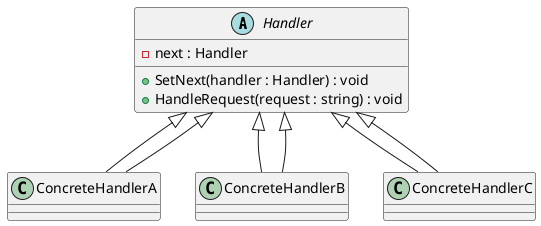
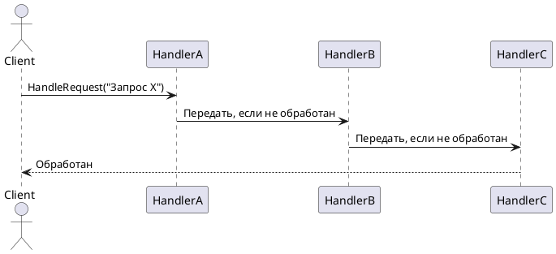
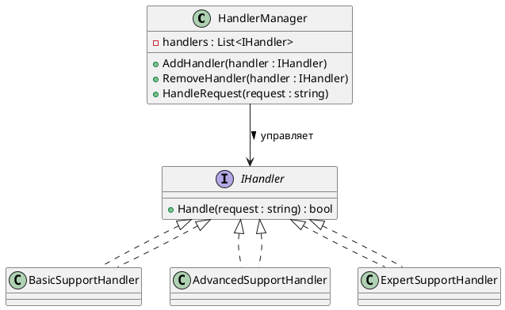

# 🔗 Chain of Responsibility (Цепочка обязанностей)

## 🧩 Уникальное название

**Chain of Responsibility (CoR, Цепочка обязанностей)**
Иногда называют: *Handler Chain*, *Обработка запроса по цепочке*.

---

## 🧠 Описание решаемой проблемы

### 🔍 Проблема

В некоторых системах запрос или событие **может обрабатываться разными объектами**,
но **неизвестно заранее**, какой именно объект обработает запрос.

Если делать проверку жёстко через условные конструкции (`if/else`), код:

* становится громоздким,
* трудно расширяемым,
* нарушает принцип **единой ответственности**.

📌 Проблема сводится к необходимости **делегировать обработку запроса по цепочке объектов**,
при этом не завязываясь на конкретные классы.

---

### 💬 Примеры задач

1. 🖥️ Система поддержки клиентов: запрос проходит через **уровни техподдержки** (Junior → Middle → Senior).
2. 💳 Банковская система: проверка транзакции через **несколько валидаторов** (лимит суммы, проверка баланса, антифрод).
3. 📄 Обработка документов: разные отделы проверяют документ и либо обрабатывают, либо передают дальше.
4. 🛡️ Логирование/фильтрация событий: событие обрабатывается первой подходящей обработкой.

---

## 🏗️ Описание способа решения

1. Создаём **абстрактный обработчик** (Handler) с методом `HandleRequest()` и ссылкой на **следующего обработчика**.
2. Каждый **конкретный обработчик** проверяет, может ли он обработать запрос:

   * если да → обрабатывает;
   * если нет → передаёт следующему обработчику в цепочке.
3. Клиент отправляет запрос в **первый объект цепочки**.
4. Цепочка может быть **линейной, древовидной или динамически конфигурируемой**.

> Идея: **разделить объекты обработки и их последовательность**, чтобы каждый объект знал только о своём месте в цепочке.

---

## 📊 Диаграмма и способ реализации

### UML (PlantUML) — структура классов



---

### UML (PlantUML) — последовательность обработки



---

## 💻 Реализация на C#

### 1️⃣ Абстрактный обработчик

```csharp
public abstract class Handler
{
    protected Handler _nextHandler;

    public void SetNext(Handler handler)
    {
        _nextHandler = handler;
    }

    public abstract void HandleRequest(string request);
}
```

---

### 2️⃣ Конкретные обработчики

```csharp
using System;

public class SupportLevel1 : Handler
{
    public override void HandleRequest(string request)
    {
        if (request == "Простой запрос")
        {
            Console.WriteLine("SupportLevel1 обработал запрос.");
        }
        else if (_nextHandler != null)
        {
            _nextHandler.HandleRequest(request);
        }
    }
}

public class SupportLevel2 : Handler
{
    public override void HandleRequest(string request)
    {
        if (request == "Средний запрос")
        {
            Console.WriteLine("SupportLevel2 обработал запрос.");
        }
        else if (_nextHandler != null)
        {
            _nextHandler.HandleRequest(request);
        }
    }
}

public class SupportLevel3 : Handler
{
    public override void HandleRequest(string request)
    {
        if (request == "Сложный запрос")
        {
            Console.WriteLine("SupportLevel3 обработал запрос.");
        }
        else
        {
            Console.WriteLine("Запрос не может быть обработан.");
        }
    }
}
```

---

### 3️⃣ Клиентский код

```csharp
public static class Program
{
    public static void Main()
    {
        // Настраиваем цепочку
        var level1 = new SupportLevel1();
        var level2 = new SupportLevel2();
        var level3 = new SupportLevel3();

        level1.SetNext(level2);
        level2.SetNext(level3);

        // Отправка запросов
        string[] requests = { "Простой запрос", "Средний запрос", "Сложный запрос", "Неизвестный запрос" };

        foreach (var request in requests)
        {
            Console.WriteLine($"\nЗапрос: {request}");
            level1.HandleRequest(request);
        }
    }
}
```

**Результат:**

```
Запрос: Простой запрос
SupportLevel1 обработал запрос.

Запрос: Средний запрос
SupportLevel2 обработал запрос.

Запрос: Сложный запрос
SupportLevel3 обработал запрос.

Запрос: Неизвестный запрос
Запрос не может быть обработан.
```

---

## ⚖️ Плюсы и минусы

### ✅ Плюсы

| Плюс                 | Описание                                                        |
| -------------------- | --------------------------------------------------------------- |
| 🔹 Ослабление связей | Клиент не знает, кто конкретно обработает запрос                |
| 🔹 Гибкость          | Можно динамически менять порядок обработчиков                   |
| 🔹 Расширяемость     | Добавление новых обработчиков не требует изменения существующих |
| 🔹 Упрощение кода    | Убирает громоздкие условные конструкции                         |

### ❌ Минусы

| Минус                            | Описание                                                |
| -------------------------------- | ------------------------------------------------------- |
| ⚙️ Нет гарантии обработки        | Запрос может пройти цепочку и остаться необработанным   |
| 🧩 Сложность отладки             | Трудно отследить, какой объект реально обработал запрос |
| 🔁 Повышение количества объектов | Каждый уровень требует отдельного класса                |

---

## 💡 Области применения

* Системы поддержки клиентов (Helpdesk, тикеты)
* Логирование и фильтрация событий
* Валидация и проверка данных (например, формы или транзакции)
* Маршрутизация запросов в распределённых системах
* Игровые движки — обработка событий, эффектов и действий персонажей

---

## 🧭 Вывод

**Chain of Responsibility** — мощный паттерн для **делегирования запросов по цепочке обработчиков**,
который:

* упрощает код клиента,
* делает систему легко расширяемой,
* обеспечивает гибкую конфигурацию последовательности обработки.

Он особенно полезен, когда **не известно заранее, какой объект обработает запрос**,
и когда важно **разделить ответственность между разными объектами**.

---

# 🔄 Chain of Responsibility с динамической цепочкой

## 💡 Идея

* Вместо жёсткой настройки цепочки через конструктор, объекты **регистрируются динамически** в список/коллекцию.
* При поступлении запроса система **проходит по всем зарегистрированным обработчикам** в порядке добавления, пока один из них не обработает запрос.
* Позволяет:

  * добавлять новые обработчики на лету,
  * менять порядок цепочки,
  * отключать обработчики временно.

---

## 💻 Реализация на C#

### 1️⃣ Интерфейс обработчика

```csharp
public interface IHandler
{
    bool Handle(string request);
}
```

> Метод `Handle` возвращает `true`, если обработчик обработал запрос, иначе `false`.

---

### 2️⃣ Конкретные обработчики

```csharp
using System;

public class BasicSupportHandler : IHandler
{
    public bool Handle(string request)
    {
        if (request.Contains("Простой"))
        {
            Console.WriteLine("BasicSupportHandler обработал запрос.");
            return true;
        }
        return false;
    }
}

public class AdvancedSupportHandler : IHandler
{
    public bool Handle(string request)
    {
        if (request.Contains("Средний"))
        {
            Console.WriteLine("AdvancedSupportHandler обработал запрос.");
            return true;
        }
        return false;
    }
}

public class ExpertSupportHandler : IHandler
{
    public bool Handle(string request)
    {
        if (request.Contains("Сложный"))
        {
            Console.WriteLine("ExpertSupportHandler обработал запрос.");
            return true;
        }
        return false;
    }
}
```

---

### 3️⃣ Динамическая цепочка (HandlerManager)

```csharp
using System.Collections.Generic;

public class HandlerManager
{
    private readonly List<IHandler> _handlers = new();

    public void AddHandler(IHandler handler)
    {
        _handlers.Add(handler);
    }

    public void RemoveHandler(IHandler handler)
    {
        _handlers.Remove(handler);
    }

    public void HandleRequest(string request)
    {
        foreach (var handler in _handlers)
        {
            if (handler.Handle(request))
                return; // запрос обработан
        }
        Console.WriteLine("Запрос не обработан никем.");
    }
}
```

---

### 4️⃣ Клиентский код

```csharp
public static class Program
{
    public static void Main()
    {
        var manager = new HandlerManager();

        // Динамически настраиваем цепочку
        manager.AddHandler(new BasicSupportHandler());
        manager.AddHandler(new ExpertSupportHandler());
        manager.AddHandler(new AdvancedSupportHandler());

        string[] requests = {
            "Простой запрос",
            "Средний запрос",
            "Сложный запрос",
            "Неизвестный запрос"
        };

        foreach (var request in requests)
        {
            Console.WriteLine($"\nЗапрос: {request}");
            manager.HandleRequest(request);
        }

        // Изменяем цепочку на лету
        Console.WriteLine("\n--- Изменение цепочки ---");
        manager.RemoveHandler(new ExpertSupportHandler()); // временно убираем эксперта

        manager.HandleRequest("Сложный запрос"); // теперь никто не обработает
    }
}
```

**Пример вывода:**

```
Запрос: Простой запрос
BasicSupportHandler обработал запрос.

Запрос: Средний запрос
AdvancedSupportHandler обработал запрос.

Запрос: Сложный запрос
ExpertSupportHandler обработал запрос.

Запрос: Неизвестный запрос
Запрос не обработан никем.

--- Изменение цепочки ---
Запрос: Сложный запрос
Запрос не обработан никем.
```

---

## 📊 UML — динамическая цепочка (PlantUML)



---

## ⚡ Преимущества динамической цепочки

* 🔹 **Гибкость**: легко добавлять и удалять обработчики во время выполнения.
* 🔹 **Контроль порядка**: можно переставлять обработчики в коллекции.
* 🔹 **Модульность**: обработчики изолированы и могут быть подключены/отключены по необходимости.
* 🔹 **Расширяемость**: новые обработчики подключаются без изменения существующих.

---

## ⚠️ Минусы

* 💾 Немного сложнее отладка, чем при статической цепочке.
* ⚙️ Нет гарантии, что запрос будет обработан, если цепочка неполная.
* 🔄 Производительность: при длинной цепочке каждый запрос проходит через всех обработчиков, пока не будет найден подходящий.

---

Этот вариант очень часто используется в **системах событий, логирования, middleware**,
например в ASP.NET Core pipeline или Express.js middleware.


