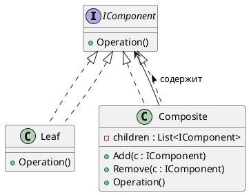
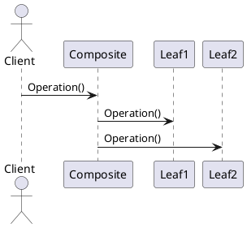
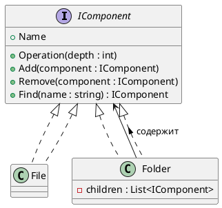
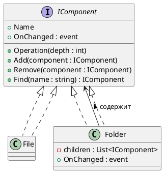

# 🌳 Composite (Компоновщик)

## 🧩 Уникальное название

**Composite (Компоновщик)**
Также известен как: *Дерево объектов*, *Композиция объектов*.

---

## 🧠 Описание решаемой проблемы

### 🔍 Проблема

Иногда в системе встречаются структуры, где **объекты могут быть как отдельными элементами, так и контейнерами других объектов**.
Например: графические элементы, файлы и папки, организационные структуры.

Если обрабатывать такие объекты по-разному (листья отдельно, узлы отдельно), код:

* становится сложным,
* трудно расширяемым,
* нарушает принцип **единой ответственности**.

**Задача:** работать с **одинаковым интерфейсом** для простых объектов и их контейнеров.

---

### 💬 Примеры задач

1. 🖼️ Графический редактор: фигуры и группы фигур (круг, прямоугольник, группа фигур).
2. 📂 Файловая система: файлы и папки, где папки могут содержать файлы и другие папки.
3. 🏢 Организационная структура: сотрудники и отделы, где отделы содержат сотрудников и другие отделы.
4. 📝 Документы: элементы документа (параграфы, таблицы, списки) и их вложенные элементы.

---

## 🏗️ Описание способа решения

Идея **Composite**:

* Ввести **абстрактный компонент** (Component), который описывает **общий интерфейс** для всех объектов.
* **Лист (Leaf)** — это конечный объект, который не содержит вложенных объектов.
* **Композит (Composite)** — объект-контейнер, который может содержать другие компоненты (листья или композиты).
* Клиент работает с **компонентами через единый интерфейс**, не различая лист и композит.

> Таким образом можно строить **деревовидные структуры объектов** и обрабатывать их **одинаково**.

---

## 📊 Диаграмма и способ реализации

### UML (PlantUML) — структура классов



---

### UML (PlantUML) — последовательность вызовов



---

## 💻 Реализация на C#

### 1️⃣ Интерфейс компонента

```csharp
using System;
using System.Collections.Generic;

public interface IComponent
{
    void Operation();
}
```

---

### 2️⃣ Лист (Leaf)

```csharp
public class File : IComponent
{
    public string Name { get; set; }

    public File(string name)
    {
        Name = name;
    }

    public void Operation()
    {
        Console.WriteLine($"Файл: {Name}");
    }
}
```

---

### 3️⃣ Композит (Composite)

```csharp
public class Folder : IComponent
{
    public string Name { get; set; }
    private readonly List<IComponent> _children = new();

    public Folder(string name)
    {
        Name = name;
    }

    public void Add(IComponent component)
    {
        _children.Add(component);
    }

    public void Remove(IComponent component)
    {
        _children.Remove(component);
    }

    public void Operation()
    {
        Console.WriteLine($"Папка: {Name}");
        foreach (var child in _children)
        {
            child.Operation();
        }
    }
}
```

---

### 4️⃣ Клиентский код

```csharp
public static class Program
{
    public static void Main()
    {
        // Создаём файлы
        var file1 = new File("file1.txt");
        var file2 = new File("file2.txt");
        var file3 = new File("file3.txt");

        // Создаём папки
        var folder1 = new Folder("Documents");
        var folder2 = new Folder("Images");

        // Добавляем файлы в папки
        folder1.Add(file1);
        folder1.Add(file2);
        folder2.Add(file3);

        // Создаём корневую папку
        var root = new Folder("Root");
        root.Add(folder1);
        root.Add(folder2);

        // Клиент вызывает операцию на корневой папке
        root.Operation();
    }
}
```

**Пример вывода:**

```
Папка: Root
Папка: Documents
Файл: file1.txt
Файл: file2.txt
Папка: Images
Файл: file3.txt
```

---

## ⚖️ Плюсы и минусы

### ✅ Плюсы

| Плюс                              | Описание                                               |
| --------------------------------- | ------------------------------------------------------ |
| 🔹 Унифицированный интерфейс      | Клиент не различает лист и композит                    |
| 🔹 Поддержка древовидных структур | Любой уровень вложенности                              |
| 🔹 Расширяемость                  | Можно добавлять новые компоненты без изменения клиента |
| 🔹 Упрощение клиентского кода     | Операции выполняются рекурсивно по всей структуре      |

### ❌ Минусы

| Минус                    | Описание                                                     |
| ------------------------ | ------------------------------------------------------------ |
| ⚙️ Сложность отладки     | Деревья могут быть глубокими и сложными                      |
| 🧩 Производительность    | Рекурсивные операции на больших деревьях могут быть дорогими |
| ⚠️ Сложность ограничения | Иногда трудно запретить добавление детей в определённые узлы |

---

## 💡 Области применения

* Файловые системы (файлы и папки)
* Графические редакторы (объекты и группы объектов)
* Организационные структуры (сотрудники и отделы)
* UI-компоненты (контейнеры и элементы интерфейса)
* Документы и XML/JSON-парсеры

---

## 🧭 Вывод

**Composite (Компоновщик)** позволяет:

* строить **иерархические структуры объектов**,
* работать с ними через **единый интерфейс**,
* обрабатывать **группы и отдельные объекты одинаково**.

Это делает код **чистым, расширяемым и легко поддерживаемым**, особенно для древовидных данных.

---

# 🌳 Composite с динамическими операциями

## 💡 Идея

* Композит может содержать другие компоненты (листья или композиты) на **любом уровне вложенности**.
* Предусмотрены **динамические операции**:

  * добавление новых элементов,
  * удаление существующих,
  * поиск компонентов по имени.
* Клиент работает через единый интерфейс `IComponent`, не заботясь о том, лист это или композит.

---

## 💻 Реализация на C#

### 1️⃣ Интерфейс компонента

```csharp
using System;

public interface IComponent
{
    string Name { get; }
    void Operation(int depth = 0);
    void Add(IComponent component);
    void Remove(IComponent component);
    IComponent Find(string name);
}
```

---

### 2️⃣ Лист (Leaf)

```csharp
public class File : IComponent
{
    public string Name { get; private set; }

    public File(string name)
    {
        Name = name;
    }

    public void Operation(int depth = 0)
    {
        Console.WriteLine($"{new string(' ', depth * 2)}Файл: {Name}");
    }

    public void Add(IComponent component)
    {
        throw new InvalidOperationException("Нельзя добавлять в лист.");
    }

    public void Remove(IComponent component)
    {
        throw new InvalidOperationException("Нельзя удалять из листа.");
    }

    public IComponent Find(string name)
    {
        return Name == name ? this : null;
    }
}
```

---

### 3️⃣ Композит (Composite)

```csharp
using System.Collections.Generic;

public class Folder : IComponent
{
    public string Name { get; private set; }
    private readonly List<IComponent> _children = new();

    public Folder(string name)
    {
        Name = name;
    }

    public void Operation(int depth = 0)
    {
        Console.WriteLine($"{new string(' ', depth * 2)}Папка: {Name}");
        foreach (var child in _children)
        {
            child.Operation(depth + 1);
        }
    }

    public void Add(IComponent component)
    {
        _children.Add(component);
    }

    public void Remove(IComponent component)
    {
        _children.Remove(component);
    }

    public IComponent Find(string name)
    {
        if (Name == name) return this;
        foreach (var child in _children)
        {
            var result = child.Find(name);
            if (result != null) return result;
        }
        return null;
    }
}
```

---

### 4️⃣ Клиентский код с динамическими операциями

```csharp
public static class Program
{
    public static void Main()
    {
        var root = new Folder("Root");

        var documents = new Folder("Documents");
        var images = new Folder("Images");

        var file1 = new File("file1.txt");
        var file2 = new File("file2.txt");
        var file3 = new File("image1.png");

        documents.Add(file1);
        documents.Add(file2);
        images.Add(file3);

        root.Add(documents);
        root.Add(images);

        Console.WriteLine("=== Начальная структура ===");
        root.Operation();

        // Динамическое добавление
        var newFile = new File("file3.txt");
        documents.Add(newFile);

        // Динамическое удаление
        documents.Remove(file1);

        Console.WriteLine("\n=== После динамических изменений ===");
        root.Operation();

        // Поиск элемента
        var found = root.Find("image1.png");
        Console.WriteLine($"\nНайденный элемент: {(found != null ? found.Name : "не найден")}");
    }
}
```

**Пример вывода:**

```
=== Начальная структура ===
Папка: Root
  Папка: Documents
    Файл: file1.txt
    Файл: file2.txt
  Папка: Images
    Файл: image1.png

=== После динамических изменений ===
Папка: Root
  Папка: Documents
    Файл: file2.txt
    Файл: file3.txt
  Папка: Images
    Файл: image1.png

Найденный элемент: image1.png
```

---

## 📊 UML — расширенный Composite (PlantUML)



---

## ⚖️ Преимущества динамического Composite

* 🔹 Поддержка **глубоких и сложных деревьев объектов**
* 🔹 Динамическое изменение структуры во время выполнения
* 🔹 Упрощение клиентского кода через единый интерфейс
* 🔹 Возможность рекурсивного поиска и операций на деревьях

---

## ⚠️ Минусы

* ⚙️ Сложнее отлаживать при больших деревьях
* 🧩 Рекурсивные операции могут быть дорогими по памяти и времени
* ⚠️ Потенциальная сложность логики добавления/удаления узлов

---

## 💡 Области применения

* Файловые системы и виртуальные каталоги
* Графические редакторы (группы объектов)
* Организационные структуры
* UI-компоненты (панели, контейнеры, виджеты)
* Деревья данных в приложениях и играх


---

# 🌳 Composite с событиями и уведомлениями

## 💡 Идея

* Каждый **композит** (или лист) может **уведомлять подписчиков** о событиях: добавление, удаление или изменение дочернего элемента.
* Клиент или система UI может подписаться на эти события, чтобы динамически реагировать на изменения структуры.
* Используется шаблон **Observer** вместе с **Composite**.

---

## 💻 Реализация на C#

### 1️⃣ Интерфейс компонента

```csharp
using System;

public interface IComponent
{
    string Name { get; }
    void Operation(int depth = 0);
    void Add(IComponent component);
    void Remove(IComponent component);
    IComponent Find(string name);
    
    event Action<IComponent, string> OnChanged;
}
```

> `OnChanged` уведомляет о типе события (`"Added"`, `"Removed"`).

---

### 2️⃣ Лист (Leaf)

```csharp
public class File : IComponent
{
    public string Name { get; private set; }
    public event Action<IComponent, string> OnChanged;

    public File(string name)
    {
        Name = name;
    }

    public void Operation(int depth = 0)
    {
        Console.WriteLine($"{new string(' ', depth * 2)}Файл: {Name}");
    }

    public void Add(IComponent component)
    {
        throw new InvalidOperationException("Нельзя добавлять в лист.");
    }

    public void Remove(IComponent component)
    {
        throw new InvalidOperationException("Нельзя удалять из листа.");
    }

    public IComponent Find(string name)
    {
        return Name == name ? this : null;
    }

    protected void Notify(string action)
    {
        OnChanged?.Invoke(this, action);
    }
}
```

---

### 3️⃣ Композит (Composite)

```csharp
using System.Collections.Generic;

public class Folder : IComponent
{
    public string Name { get; private set; }
    private readonly List<IComponent> _children = new();

    public event Action<IComponent, string> OnChanged;

    public Folder(string name)
    {
        Name = name;
    }

    public void Operation(int depth = 0)
    {
        Console.WriteLine($"{new string(' ', depth * 2)}Папка: {Name}");
        foreach (var child in _children)
        {
            child.Operation(depth + 1);
        }
    }

    public void Add(IComponent component)
    {
        _children.Add(component);
        component.OnChanged += Component_OnChanged;
        Notify(component, "Added");
    }

    public void Remove(IComponent component)
    {
        if (_children.Remove(component))
        {
            component.OnChanged -= Component_OnChanged;
            Notify(component, "Removed");
        }
    }

    public IComponent Find(string name)
    {
        if (Name == name) return this;
        foreach (var child in _children)
        {
            var result = child.Find(name);
            if (result != null) return result;
        }
        return null;
    }

    private void Component_OnChanged(IComponent component, string action)
    {
        Notify(component, action);
    }

    protected void Notify(IComponent component, string action)
    {
        OnChanged?.Invoke(component, action);
    }
}
```

---

### 4️⃣ Клиентский код с подпиской на события

```csharp
public static class Program
{
    public static void Main()
    {
        var root = new Folder("Root");

        // Подписка на события
        root.OnChanged += (component, action) =>
        {
            Console.WriteLine($"Событие: {action} -> {component.Name}");
        };

        var documents = new Folder("Documents");
        var file1 = new File("file1.txt");
        var file2 = new File("file2.txt");

        documents.Add(file1);
        documents.Add(file2);

        root.Add(documents);

        Console.WriteLine("\n=== Структура ===");
        root.Operation();

        Console.WriteLine("\n=== Динамическое изменение ===");
        var newFile = new File("file3.txt");
        documents.Add(newFile);     // событие Added
        documents.Remove(file1);    // событие Removed
    }
}
```

**Пример вывода:**

```
Событие: Added -> file1.txt
Событие: Added -> file2.txt
Событие: Added -> Documents
Событие: Added -> file1.txt
Событие: Added -> file2.txt

=== Структура ===
Папка: Root
  Папка: Documents
    Файл: file1.txt
    Файл: file2.txt

=== Динамическое изменение ===
Событие: Added -> file3.txt
Событие: Removed -> file1.txt
```

---

## 📊 UML — Composite с событиями (PlantUML)



---

## ⚖️ Преимущества

* 🔹 Поддержка **динамических изменений** структуры во время выполнения
* 🔹 Возможность **подписываться на события** и реагировать на добавление/удаление
* 🔹 Унифицированный интерфейс для листьев и композитов
* 🔹 Отлично подходит для **UI, редакторов, игровых сцен**

---

## ⚠️ Минусы

* ⚙️ Дополнительная сложность за счёт событий
* 🧩 Нужно следить за подписками, чтобы не было утечек памяти
* 🔄 При больших деревьях количество уведомлений может быть высоким

---

## 💡 Области применения

* UI-компоненты с динамическими контейнерами
* Игровые движки — сцены и объекты с реакцией на изменения
* Редакторы документов и графических объектов
* Динамические деревья данных, где клиент должен реагировать на изменения


