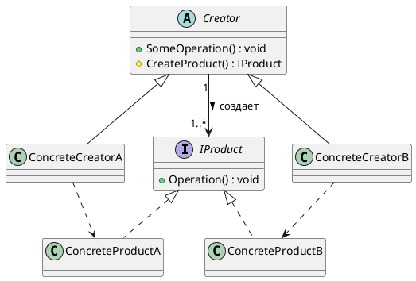
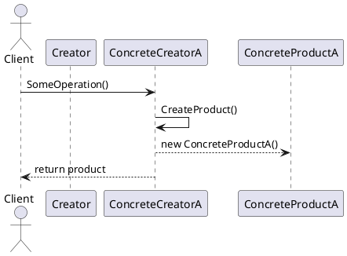

# Factory Method (Фабричный метод)

## 🧩 Уникальное название

**Factory Method (Фабричный метод)**
(иногда называют *Виртуальный конструктор*)

---

## 🧠 Описание решаемой проблемы

### 🔍 Проблема

Необходимо **создавать объекты**, но **не жёстко привязываться** к конкретным классам, которые создаются.

Если класс знает **слишком много о деталях создания** своих зависимостей, это нарушает принцип **отделения абстракции от реализации** (Open/Closed, DIP).

Другими словами — как создавать объекты, **сохраняя гибкость и расширяемость**?

---

### 💬 Примеры задач:

1. Программа работает с документами разных форматов: `.pdf`, `.docx`, `.txt`.
   Нужно, чтобы добавление нового типа документа не требовало изменения основной логики.
2. В игре разные типы врагов (Zombie, Robot, Alien). Логика поведения общая, но создание конкретного врага — разное.
3. В приложении с GUI разные операционные системы (Windows / macOS / Linux) создают разные кнопки и окна.

---

## 🏗️ Описание способа решения

Идея:

* В базовом классе определяется **абстрактный метод-фабрика** (Factory Method), который возвращает объект **общего интерфейса (абстракции)**.
* Подклассы **переопределяют фабричный метод**, чтобы создавать **конкретные типы объектов**.

То есть, вместо того чтобы клиент знал **какой класс создавать**, он вызывает фабричный метод, и тот решает, **какой именно объект вернуть**.

---

## 📊 Диаграмма и способ реализации

### UML (PlantUML) — диаграмма классов



**Описание:**

* `Creator` — абстрактный создатель, содержит метод `CreateProduct()`, который возвращает `IProduct`.
* `ConcreteCreatorA/B` — конкретные фабрики, реализующие, какой именно продукт создать.
* Клиент работает с `Creator`, не зная о конкретных классах продуктов.

---

### UML (PlantUML) — последовательность создания



---

## 💻 Реализация на C#

### 1️⃣ Продукты (интерфейс и реализации)

```csharp
public interface IProduct
{
    string Operation();
}

public class ConcreteProductA : IProduct
{
    public string Operation() => "Результат: продукт A";
}

public class ConcreteProductB : IProduct
{
    public string Operation() => "Результат: продукт B";
}
```

---

### 2️⃣ Создатели (абстрактный и конкретные)

```csharp
public abstract class Creator
{
    // Фабричный метод
    public abstract IProduct CreateProduct();

    // Общая бизнес-логика
    public string SomeOperation()
    {
        var product = CreateProduct();
        return $"Creator: использует {product.Operation()}";
    }
}

public class ConcreteCreatorA : Creator
{
    public override IProduct CreateProduct() => new ConcreteProductA();
}

public class ConcreteCreatorB : Creator
{
    public override IProduct CreateProduct() => new ConcreteProductB();
}
```

---

### 3️⃣ Клиентский код

```csharp
using System;

public class Client
{
    public static void Main()
    {
        Creator creatorA = new ConcreteCreatorA();
        Creator creatorB = new ConcreteCreatorB();

        Console.WriteLine(creatorA.SomeOperation());
        Console.WriteLine(creatorB.SomeOperation());
    }
}
```

**Результат выполнения:**

```
Creator: использует Результат: продукт A
Creator: использует Результат: продукт B
```

---

## 🔍 Пример из реальной практики

### Пример: уведомления

Хотим отправлять уведомления пользователям, но способ (email, SMS, push) может различаться.
Клиент не должен зависеть от конкретной реализации.

```csharp
public interface INotifier
{
    void Notify(string message);
}

public class EmailNotifier : INotifier
{
    public void Notify(string message)
    {
        Console.WriteLine($"Отправка EMAIL: {message}");
    }
}

public class SmsNotifier : INotifier
{
    public void Notify(string message)
    {
        Console.WriteLine($"Отправка SMS: {message}");
    }
}

public abstract class NotifierCreator
{
    public abstract INotifier CreateNotifier();

    public void Send(string message)
    {
        var notifier = CreateNotifier();
        notifier.Notify(message);
    }
}

public class EmailNotifierCreator : NotifierCreator
{
    public override INotifier CreateNotifier() => new EmailNotifier();
}

public class SmsNotifierCreator : NotifierCreator
{
    public override INotifier CreateNotifier() => new SmsNotifier();
}

public class Program
{
    public static void Main()
    {
        NotifierCreator creator = new EmailNotifierCreator();
        creator.Send("Добро пожаловать!");

        creator = new SmsNotifierCreator();
        creator.Send("Ваш код подтверждения: 1234");
    }
}
```

---

## ⚖️ Плюсы и минусы, области применения, примеры

### ✅ Плюсы

| Плюс                             | Описание                                                          |
| -------------------------------- | ----------------------------------------------------------------- |
| 🔹 Ослабление связей             | Клиентский код не зависит от конкретных классов продуктов         |
| 🔹 Принцип открытости/закрытости | Новые типы продуктов добавляются без изменения существующего кода |
| 🔹 Упрощение тестирования        | Можно легко подменить фабрику для тестов                          |
| 🔹 Централизация логики создания | Легче контролировать и модифицировать процесс создания объектов   |

---

### ❌ Минусы

| Минус                          | Описание                                                              |
| ------------------------------ | --------------------------------------------------------------------- |
| ⚙️ Усложнение кода             | Добавляются новые классы (Creator, ConcreteCreator)                   |
| 📚 Может быть избыточен        | Для простых случаев (один тип продукта) излишен                       |
| 🔁 Иногда требует наследования | При добавлении новых продуктов нужно создавать новые подклассы фабрик |

---

### 💡 Области применения

* Когда класс **не знает заранее**, какие объекты ему нужно создавать.
* Когда требуется, чтобы создание объектов было **делегировано подклассам**.
* Когда необходимо **расширять систему новыми типами**, не изменяя существующий код.

---

### 🧱 Примеры из реальных систем

| Сфера        | Пример                                                                 |
| ------------ | ---------------------------------------------------------------------- |
| GUI          | Разные фабрики создают кнопки для Windows, macOS, Linux                |
| Игры         | Фабрика врагов: `EnemyFactory` → `Zombie`, `Robot`, `Alien`            |
| Документы    | `DocumentFactory` → `PdfDocument`, `WordDocument`, `TxtDocument`       |
| Коммуникации | `NotificationFactory` → `EmailNotifier`, `SmsNotifier`, `PushNotifier` |

---

## 🧭 Сравнение Factory Method и других паттернов

| Паттерн              | Назначение                              |
| -------------------- | --------------------------------------- |
| **Factory Method**   | Делегирует создание объектов подклассам |
| **Abstract Factory** | Создаёт семейства связанных объектов    |
| **Builder**          | Пошагово конструирует сложные объекты   |
| **Prototype**        | Клонирует существующие объекты          |

---

## 🏁 Вывод

**Factory Method** — это элегантный способ передать ответственность за создание объектов подклассам, не нарушая принципы SOLID.

Он помогает:

* избавиться от жёстких зависимостей между классами,
* повысить расширяемость системы,
* структурировать код вокруг точек создания объектов.

Однако, если система простая и не предполагает множества вариантов продуктов — этот паттерн может быть избыточен.

---
