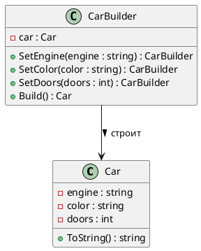

# 💧 Fluent Builder (Плавный строитель)

## 🧩 Уникальное название

**Fluent Builder (Плавный строитель)**
Также известен как: *Чейнинг билдер*, *Метод цепочки вызовов*.

---

## 🧠 Краткое описание

Fluent Builder — это **вариант паттерна Builder**,
в котором клиент вызывает методы строителя **цепочкой**, а не через директора.

Каждый метод возвращает ссылку на текущий объект `this`,
что позволяет удобно комбинировать шаги построения:

```csharp
var car = new CarBuilder()
    .SetEngine("V8")
    .SetColor("Красный")
    .SetDoors(2)
    .Build();
```

📌
Такой подход особенно популярен в C#, Java и TypeScript,
поскольку делает API читаемым и декларативным.

---

## 🧩 Основная идея

* У каждого метода `SetXyz(...)` тип возвращаемого значения — сам строитель (`CarBuilder`).
* Методы вызываются цепочкой без промежуточных переменных.
* Не нужен отдельный объект `Director`.
* Конечный объект создаётся вызовом `Build()`.

---

## 📊 UML — Fluent Builder



---

## 💻 Пример реализации на C#

```csharp
using System;

public class Car
{
    public string Engine { get; set; }
    public string Color { get; set; }
    public int Doors { get; set; }

    public override string ToString() =>
        $"{Color} автомобиль с двигателем {Engine} и {Doors} дверями";
}

public class CarBuilder
{
    private readonly Car _car = new();

    public CarBuilder SetEngine(string engine)
    {
        _car.Engine = engine;
        return this;
    }

    public CarBuilder SetColor(string color)
    {
        _car.Color = color;
        return this;
    }

    public CarBuilder SetDoors(int doors)
    {
        _car.Doors = doors;
        return this;
    }

    public Car Build()
    {
        return _car;
    }
}

public static class Program
{
    public static void Main()
    {
        var car = new CarBuilder()
            .SetEngine("V8")
            .SetColor("Красный")
            .SetDoors(2)
            .Build();

        Console.WriteLine(car);
    }
}
```

**Вывод:**

```
Красный автомобиль с двигателем V8 и 2 дверями
```

---

## 💡 Преимущества Fluent Builder

| Преимущество               | Описание                                     |
| -------------------------- | -------------------------------------------- |
| ✨ Читаемость               | Код построения выглядит как декларация       |
| 🧩 Без директора           | Процесс сборки контролируется самим клиентом |
| 🔁 Гибкость                | Можно вызвать только нужные методы           |
| 🧱 Расширяемость           | Можно легко добавить новые шаги              |
| 💬 Удобство автодополнения | IDE подсказывает доступные шаги              |

---

## ⚠️ Недостатки

| Недостаток                           | Описание                                                 |
| ------------------------------------ | -------------------------------------------------------- |
| 🚫 Нет строгого порядка сборки       | Возможны ошибки, если вызвать шаги не в том порядке      |
| 🧩 Нет контроля логики               | Без директора нельзя навязать бизнес-последовательность  |
| ⚙️ Для сложных сценариев — избыточен | При сложной логике лучше классический Builder с Director |

---

## 🧭 Когда использовать Fluent Builder

* Когда нужно **создавать объект с множеством опций**,
  но последовательность не критична.
* Когда важно, чтобы **код сборки был читаемым**, например:

  * при настройке конфигураций (`HttpRequestBuilder`, `QueryBuilder`, `UIBuilder`),
  * при тестировании (например, *Test Data Builders*).
* Когда вы проектируете **DSL (Domain Specific Language)** внутри кода.

---

## 🧱 Fluent Builder против классического Builder

| Характеристика              | Классический Builder        | Fluent Builder        |
| --------------------------- | --------------------------- | --------------------- |
| Управление процессом        | Через `Director`            | Через клиента         |
| Контроль последовательности | Строгий                     | Гибкий                |
| Уровень абстракции          | Выше (разделяет роли)       | Ниже (один класс)     |
| Подходит для                | Сложных последовательностей | Простых конфигураций  |
| Реализация в C#             | Через интерфейсы            | Через цепочку вызовов |

---

## 💬 Пример из реальных систем

| Система                  | Реализация                                                                 |
| ------------------------ | -------------------------------------------------------------------------- |
| 🔗 `HttpClient` (C#)     | Конфигурация запроса через `HttpRequestMessage`                            |
| 🧪 `Moq` / `NSubstitute` | Настройка моков через цепочки                                              |
| 🧾 `ReportBuilder`       | Пошаговое добавление секций в отчёт                                        |
| 🎮 Game Engines          | Создание объектов через цепочки `SetPosition()`, `SetTexture()`, `Build()` |
| 🧰 Entity Framework      | Конфигурация сущностей через Fluent API (`modelBuilder.Entity<>()...`)     |

---

## 📘 Заключение

**Fluent Builder** — современный, читаемый и удобный вариант паттерна **Builder**,
который делает процесс построения:

* декларативным,
* гибким,
* и лёгким в сопровождении.

Он идеально подходит для **C#**, **Java**, **Kotlin**, **TypeScript**,
где читаемость и автодополнение — важные части API-дизайна.

