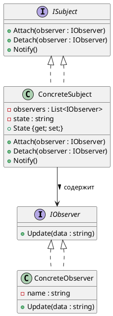
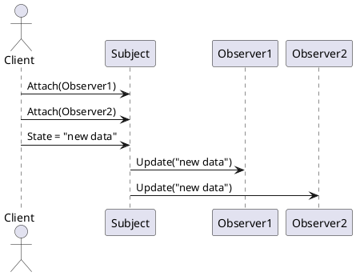
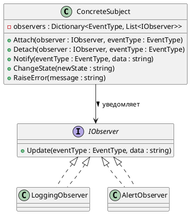

# 👀 Observer (Наблюдатель)

## 🧩 Уникальное название

**Observer (Наблюдатель)**
Также известен как: *Publish-Subscribe*, *Listener*, *Dependents*.

---

## 🧠 Описание решаемой проблемы

### 🔍 Проблема

В системах часто встречается ситуация, когда **изменение состояния одного объекта должно автоматически отражаться на других объектах**,
при этом эти объекты не должны быть **жёстко связаны между собой**.

Если делать это напрямую через вызовы методов:

* создаются **жёсткие зависимости** между объектами,
* код становится трудно расширяемым и поддерживаемым,
* нарушается принцип **открытости/закрытости**.

**Задача:** уведомлять заинтересованные объекты о событиях или изменениях **без сильной связи**.

---

### 💬 Примеры задач

1. 📊 GUI: изменение данных модели автоматически обновляет представление (View).
2. 📰 Система уведомлений: подписчики получают оповещения о событиях.
3. 📈 Финансовая система: котировки акций обновляются у всех заинтересованных клиентов.
4. 🛠️ Логирование: несколько логгеров реагируют на события приложения.
5. 🕹️ Игровые движки: объекты реагируют на события (здоровье персонажа, коллизии, эффекты).

---

## 🏗️ Описание способа решения

1. Создаём **субъект (Subject)**, который хранит состояние и список наблюдателей.
2. Наблюдатели (**Observer**) подписываются на субъект и получают уведомления при изменении состояния.
3. Субъект уведомляет всех подписчиков, вызывая у них метод `Update()`.
4. Наблюдатели реализуют общий интерфейс и реагируют на изменения по-своему.

> Идея: **разделить объекты, вызывающие событие, и объекты, реагирующие на него**, сохраняя слабую связанность.

---

## 📊 Диаграмма и способ реализации

### UML (PlantUML) — структура классов



---

### UML (PlantUML) — последовательность уведомлений



---

## 💻 Реализация на C#

### 1️⃣ Интерфейсы субъекта и наблюдателя

```csharp
using System;
using System.Collections.Generic;

public interface IObserver
{
    void Update(string data);
}

public interface ISubject
{
    void Attach(IObserver observer);
    void Detach(IObserver observer);
    void Notify();
}
```

---

### 2️⃣ Субъект (Subject)

```csharp
public class ConcreteSubject : ISubject
{
    private readonly List<IObserver> _observers = new();
    private string _state;

    public string State
    {
        get => _state;
        set
        {
            _state = value;
            Notify();
        }
    }

    public void Attach(IObserver observer) => _observers.Add(observer);
    public void Detach(IObserver observer) => _observers.Remove(observer);

    public void Notify()
    {
        foreach (var observer in _observers)
        {
            observer.Update(_state);
        }
    }
}
```

---

### 3️⃣ Наблюдатель (Observer)

```csharp
public class ConcreteObserver : IObserver
{
    private readonly string _name;

    public ConcreteObserver(string name)
    {
        _name = name;
    }

    public void Update(string data)
    {
        Console.WriteLine($"{_name} получил обновление: {data}");
    }
}
```

---

### 4️⃣ Клиентский код

```csharp
public static class Program
{
    public static void Main()
    {
        var subject = new ConcreteSubject();

        var observer1 = new ConcreteObserver("Observer1");
        var observer2 = new ConcreteObserver("Observer2");

        subject.Attach(observer1);
        subject.Attach(observer2);

        subject.State = "Состояние 1";  // уведомление всех наблюдателей
        subject.State = "Состояние 2";

        subject.Detach(observer1);

        subject.State = "Состояние 3";  // уведомление только observer2
    }
}
```

**Пример вывода:**

```
Observer1 получил обновление: Состояние 1
Observer2 получил обновление: Состояние 1
Observer1 получил обновление: Состояние 2
Observer2 получил обновление: Состояние 2
Observer2 получил обновление: Состояние 3
```

---

## ⚖️ Плюсы и минусы

### ✅ Плюсы

| Плюс                    | Описание                                                 |
| ----------------------- | -------------------------------------------------------- |
| 🔹 Слабая связанность   | Субъект и наблюдатели знают друг о друге минимально      |
| 🔹 Расширяемость        | Легко добавлять новые наблюдатели без изменения субъекта |
| 🔹 Реактивность         | Автоматическое обновление всех заинтересованных объектов |
| 🔹 Подходит для событий | Отлично для publish-subscribe систем                     |

### ❌ Минусы

| Минус                     | Описание                                        |
| ------------------------- | ----------------------------------------------- |
| ⚙️ Возможны утечки памяти | Если не отписывать наблюдателей                 |
| 🧩 Массовое уведомление   | Много наблюдателей может замедлить систему      |
| ⚠️ Нет контроля порядка   | Все уведомления происходят в порядке добавления |

---

## 💡 Области применения

* UI и MVVM (связка модели и представления)
* Системы уведомлений, логирования, мониторинга
* Игровые движки (события, эффекты, триггеры)
* Publish-Subscribe системы (сообщения, события в сервисах)
* Реактивное программирование (Rx, IObservable/IObserver)

---

## 🧭 Вывод

**Observer (Наблюдатель)** позволяет:

* строить **слабосвязанные системы с событиями**,
* автоматически уведомлять заинтересованные объекты,
* расширять систему без модификации существующего кода.

Он широко используется в **UI, событиях и реальном времени**, где требуется реакция на изменения состояния объекта.

---

# 👀 Observer с динамическими подписками и фильтрацией

## 💡 Идея

* Каждый наблюдатель может **подписываться на конкретные типы событий**.
* Подписки можно **добавлять и удалять динамически** во время выполнения.
* Субъект уведомляет только тех наблюдателей, которые подписаны на конкретный тип события.

Это позволяет строить **гибкие реактивные системы**.

---

## 💻 Реализация на C#

### 1️⃣ Интерфейс события и наблюдателя

```csharp
using System;

public enum EventType
{
    StateChanged,
    ErrorOccurred,
    Warning
}

public interface IObserver
{
    void Update(EventType eventType, string data);
}
```

---

### 2️⃣ Субъект с фильтрацией событий

```csharp
using System.Collections.Generic;

public class ConcreteSubject
{
    // Словарь: ключ - тип события, значение - список наблюдателей
    private readonly Dictionary<EventType, List<IObserver>> _observers 
        = new Dictionary<EventType, List<IObserver>>();

    public void Attach(IObserver observer, EventType eventType)
    {
        if (!_observers.ContainsKey(eventType))
            _observers[eventType] = new List<IObserver>();

        _observers[eventType].Add(observer);
    }

    public void Detach(IObserver observer, EventType eventType)
    {
        if (_observers.ContainsKey(eventType))
            _observers[eventType].Remove(observer);
    }

    public void Notify(EventType eventType, string data)
    {
        if (!_observers.ContainsKey(eventType)) return;

        foreach (var observer in _observers[eventType])
        {
            observer.Update(eventType, data);
        }
    }

    // Пример изменения состояния
    public void ChangeState(string newState)
    {
        Notify(EventType.StateChanged, newState);
    }

    public void RaiseError(string message)
    {
        Notify(EventType.ErrorOccurred, message);
    }
}
```

---

### 3️⃣ Конкретные наблюдатели

```csharp
using System;

public class LoggingObserver : IObserver
{
    private readonly string _name;
    public LoggingObserver(string name) => _name = name;

    public void Update(EventType eventType, string data)
    {
        Console.WriteLine($"{_name} получил событие {eventType}: {data}");
    }
}

public class AlertObserver : IObserver
{
    private readonly string _name;
    public AlertObserver(string name) => _name = name;

    public void Update(EventType eventType, string data)
    {
        Console.WriteLine($"[ALERT] {_name} получил событие {eventType}: {data}");
    }
}
```

---

### 4️⃣ Клиентский код с динамическими подписками

```csharp
public static class Program
{
    public static void Main()
    {
        var subject = new ConcreteSubject();

        var logger = new LoggingObserver("Logger1");
        var alert = new AlertObserver("AlertSystem");

        // Динамическая подписка на события
        subject.Attach(logger, EventType.StateChanged);
        subject.Attach(logger, EventType.ErrorOccurred);

        subject.Attach(alert, EventType.ErrorOccurred);

        // Генерация событий
        subject.ChangeState("Состояние обновлено");   // уведомление logger
        subject.RaiseError("Ошибка подключения");     // уведомление logger и alert

        // Динамическое удаление подписки
        subject.Detach(logger, EventType.ErrorOccurred);
        subject.RaiseError("Другая ошибка");          // уведомление только alert
    }
}
```

**Пример вывода:**

```
Logger1 получил событие StateChanged: Состояние обновлено
Logger1 получил событие ErrorOccurred: Ошибка подключения
[ALERT] AlertSystem получил событие ErrorOccurred: Ошибка подключения
[ALERT] AlertSystem получил событие ErrorOccurred: Другая ошибка
```

---

## 📊 UML — Observer с фильтрацией событий (PlantUML)



---

## ⚖️ Преимущества

* 🔹 **Гибкость подписок**: наблюдатели получают только интересующие события
* 🔹 **Динамическое управление**: можно добавлять/удалять подписки во время выполнения
* 🔹 **Слабая связанность**: субъект не знает, что делают наблюдатели
* 🔹 **Масштабируемость**: легко подключать новые обработчики событий

---

## ⚠️ Минусы

* ⚙️ Сложность управления подписками в больших системах
* 🧩 Возможные утечки памяти при несвоевременной отписке
* 🔄 Потенциальная нагрузка при массовых уведомлениях

---

## 💡 Области применения

* UI и MVVM с фильтрацией событий
* Игровые движки: события персонажей, эффекты, коллизии
* Системы мониторинга и логирования
* Publish-Subscribe системы с фильтром по типу события
* Реактивные системы и потоковое программирование


