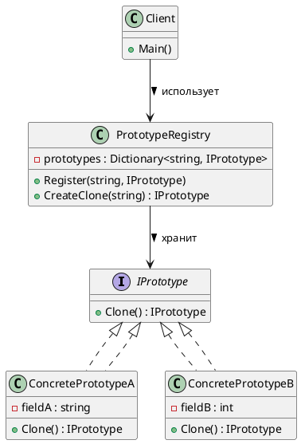

**Prototype Registry (Реестр прототипов)** — это очень частое и практичное расширение паттерна **Prototype**.

---

# 🧾 Prototype Registry (Реестр Прототипов)

## 🧩 Уникальное название

**Prototype Registry (Реестр Прототипов)**
Также известен как: *Prototype Manager*, *Prototype Cache*.

---

## 🧠 Описание решаемой проблемы

### 🔍 Проблема

При использовании паттерна **Prototype**, объекты-прототипы должны **где-то храниться**, чтобы можно было быстро получить нужный шаблон и склонировать его.
Если таких прототипов десятки или сотни — например, разные типы врагов, кнопок интерфейса, документов — управлять ими вручную неудобно.

📌 **Реестр прототипов** решает эту проблему, предоставляя централизованное хранилище шаблонов.

---

### 💬 Пример задач

1. 🎮 В игре — создание врагов разных типов (`Orc`, `Goblin`, `Troll`) на основе заранее зарегистрированных прототипов.
2. 🧾 В текстовом редакторе — создание новых документов на основе шаблонов (`Отчёт`, `Резюме`, `Контракт`).
3. 🖼️ В GUI — хранение стандартных элементов интерфейса для быстрого клонирования.

---

## 🏗️ Описание способа решения

* Создаётся **класс Registry (реестр)**, который хранит ассоциации вида
  `"ключ → прототип"`.
* Клиент запрашивает объект по ключу и получает **его клон**, а не сам прототип.
* Таким образом, можно быстро и безопасно создавать объекты нужного типа, не зная их реализацию.

📘 Реестр может быть реализован как:

* Singleton (один общий для всей программы),
* или обычный объект, передаваемый в контексте.

---

## 📊 Диаграмма и способ реализации

### UML — структура классов Prototype Registry



---

## 💻 Пример реализации на C#

```csharp
using System;
using System.Collections.Generic;

// 1️⃣ Интерфейс прототипа
public interface IPrototype
{
    IPrototype Clone();
}

// 2️⃣ Конкретные прототипы
public class Enemy : IPrototype
{
    public string Name { get; set; }
    public int Health { get; set; }
    public string Weapon { get; set; }

    public Enemy(string name, int health, string weapon)
    {
        Name = name;
        Health = health;
        Weapon = weapon;
    }

    public IPrototype Clone()
    {
        return (IPrototype)this.MemberwiseClone(); // поверхностное копирование
    }

    public override string ToString()
        => $"{Name} [HP={Health}, Weapon={Weapon}]";
}

public class Tower : IPrototype
{
    public string Type { get; set; }
    public int Damage { get; set; }

    public Tower(string type, int damage)
    {
        Type = type;
        Damage = damage;
    }

    public IPrototype Clone()
    {
        return (IPrototype)this.MemberwiseClone();
    }

    public override string ToString()
        => $"Tower Type={Type}, Damage={Damage}";
}

// 3️⃣ Реестр прототипов
public class PrototypeRegistry
{
    private readonly Dictionary<string, IPrototype> _prototypes = new();

    public void Register(string key, IPrototype prototype)
    {
        _prototypes[key] = prototype;
    }

    public IPrototype CreateClone(string key)
    {
        if (!_prototypes.ContainsKey(key))
            throw new ArgumentException($"Прототип с ключом '{key}' не найден.");

        return _prototypes[key].Clone();
    }
}

// 4️⃣ Клиентский код
public static class Program
{
    public static void Main()
    {
        var registry = new PrototypeRegistry();

        // Регистрируем базовые шаблоны
        registry.Register("orc", new Enemy("Orc", 100, "Axe"));
        registry.Register("goblin", new Enemy("Goblin", 50, "Dagger"));
        registry.Register("tower", new Tower("Defense", 80));

        // Клонируем объекты
        var orc1 = (Enemy)registry.CreateClone("orc");
        var goblin1 = (Enemy)registry.CreateClone("goblin");
        var tower1 = (Tower)registry.CreateClone("tower");

        // Изменяем клон
        orc1.Weapon = "Hammer";
        orc1.Health = 120;

        Console.WriteLine(orc1);
        Console.WriteLine(goblin1);
        Console.WriteLine(tower1);
    }
}
```

**Вывод:**

```
Orc [HP=120, Weapon=Hammer]
Goblin [HP=50, Weapon=Dagger]
Tower Type=Defense, Damage=80
```

---

## ⚖️ Плюсы и минусы

| ✅ Плюсы                                      | ❌ Минусы                                         |
| -------------------------------------------- | ------------------------------------------------ |
| Централизованное управление объектами        | Нужно поддерживать консистентность реестра       |
| Быстрое создание клонов                      | Возможны ошибки при копировании ссылочных данных |
| Упрощение кода клиента                       | Усложняет архитектуру, если прототипов немного   |
| Гибкость — можно подменять прототипы на лету | При глубоком копировании — больше кода           |

---

## 💡 Области применения

* Игровые движки — для хранения шаблонов врагов, предметов, объектов мира.
* Редакторы и IDE — шаблоны документов, окон, панелей.
* Конфигурационные системы — сохранение и клонирование заранее настроенных профилей.
* Инжиниринговые приложения — хранение типовых узлов, деталей или модулей.

---

## 🧩 Пример расширения: Singleton + Registry

Можно сделать **глобальный реестр прототипов** в виде Singleton:

```csharp
public sealed class GlobalPrototypeRegistry : PrototypeRegistry
{
    private static readonly Lazy<GlobalPrototypeRegistry> _instance =
        new(() => new GlobalPrototypeRegistry());

    public static GlobalPrototypeRegistry Instance => _instance.Value;

    private GlobalPrototypeRegistry() { }
}
```

Использование:

```csharp
GlobalPrototypeRegistry.Instance.Register("orc", new Enemy("Orc", 100, "Axe"));
var clone = GlobalPrototypeRegistry.Instance.CreateClone("orc");
```

---

## 📘 Когда использовать Prototype Registry

| Признак                                 | Почему подходит                                  |
| --------------------------------------- | ------------------------------------------------ |
| 🔁 Частое создание однотипных объектов  | Ускоряет создание                                |
| 📦 Есть ограниченный набор шаблонов     | Централизованное хранение                        |
| 🧱 Важно состояние объектов             | Позволяет создавать объекты с готовым состоянием |
| 🧩 Нужно изолировать клиента от классов | Клиент работает только с ключами и интерфейсом   |

---

## 🧭 Вывод

**Prototype Registry** — это надстройка над паттерном **Prototype**,
которая позволяет удобно **управлять множеством шаблонов** через централизованный реестр.

📌 Этот паттерн часто используется в:

* игровых движках,
* системах шаблонов,
* фабриках UI-компонентов.

Он повышает **гибкость**, **скорость создания объектов** и **модульность кода**.

