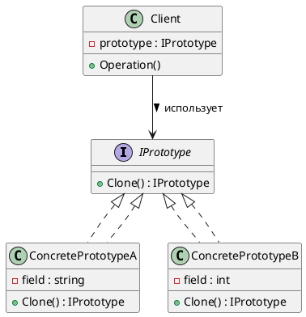
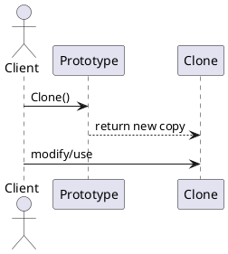

# 🧬 Prototype (Прототип)

## 🧩 Уникальное название

**Prototype (Прототип)**
Также известен как: *Клон*, *Шаблон объекта*.

---

## 🧠 Описание решаемой проблемы

### 🔍 Проблема

Необходимо **создавать новые объекты**, но их **инициализация сложна, ресурсоёмка** или **зависит от сложного состояния**.
Например, создание объекта может требовать:

* долгой загрузки данных,
* обращения к БД или сети,
* дорогостоящих вычислений.

В таких случаях выгодно **копировать уже существующий объект** (прототип),
вместо того чтобы создавать новый «с нуля».

---

### 💬 Примеры задач

1. 🎮 В игре нужно быстро создавать сотни однотипных врагов, оружия или частиц — проще клонировать базовый объект.
2. 🏗️ В графическом редакторе дублирование фигур или элементов интерфейса.
3. 💾 В приложении с документами создание новых документов на основе шаблона.
4. 🌐 В системах сериализации/десериализации — клон объекта с сохранением состояния.

---

## 🏗️ Описание способа решения

Идея проста:

* Вместо создания объектов через конструктор (`new`), вы создаёте **копию существующего объекта-прототипа**.
* Класс определяет метод `Clone()`, который создаёт копию текущего экземпляра.
* Клиент не заботится о том, **какой конкретный класс** клонируется.

Прототип может быть:

* **поверхностным (shallow copy)** — копируются только значения, без глубоких структур;
* **глубоким (deep copy)** — копируется всё дерево объектов.

---

## 📊 Диаграмма и способ реализации

### UML (PlantUML) — структура классов



---

### UML (PlantUML) — последовательность клонирования



---

## 💻 Реализация на C#

### 1️⃣ Интерфейс прототипа

```csharp
public interface IPrototype<T>
{
    T Clone();
}
```

---

### 2️⃣ Конкретные прототипы

```csharp
public class Circle : IPrototype<Circle>
{
    public int X { get; set; }
    public int Y { get; set; }
    public int Radius { get; set; }

    public Circle(int x, int y, int radius)
    {
        X = x;
        Y = y;
        Radius = radius;
    }

    // Поверхностное копирование
    public Circle Clone()
    {
        return (Circle)this.MemberwiseClone();
    }

    public override string ToString()
        => $"Circle: X={X}, Y={Y}, Radius={Radius}";
}

public class Rectangle : IPrototype<Rectangle>
{
    public int Width { get; set; }
    public int Height { get; set; }

    public Rectangle(int w, int h)
    {
        Width = w;
        Height = h;
    }

    public Rectangle Clone()
    {
        return (Rectangle)this.MemberwiseClone();
    }

    public override string ToString()
        => $"Rectangle: Width={Width}, Height={Height}";
}
```

---

### 3️⃣ Клиентский код

```csharp
using System;
using System.Collections.Generic;

public class PrototypeRegistry
{
    private readonly Dictionary<Type, object> _prototypes = new();

    public void Register<T>(T prototype)
    {
        _prototypes[typeof(T)] = prototype;
    }

    public T CreateClone<T>()
    {
        if (_prototypes[typeof(T)] is IPrototype<T> proto)
            return proto.Clone();
        throw new ArgumentException("Прототип не найден или несовместим");
     }
}

public static class Program
{
    public static void Main()
    {
        var registry = new PrototypeRegistry();
        registry.Register(new Circle(10, 20, 5));
        registry.Register(new Rectangle(30, 40));
        
        var circle1 = registry.CreateClone<Circle>();
        var circle2 = registry.CreateClone<Circle>();
        var rect1 = registry.CreateClone<Rectangle>();
        
        // Изменяем клон
        circle1.Radius = 15;
        
        Console.WriteLine(circle1);
        Console.WriteLine(circle2);
        Console.WriteLine(rect1);
    }
}
```

**Результат:**

```
Circle: X=10, Y=20, Radius=15
Rectangle: Width=30, Height=40
```

---

## 💎 Глубокое копирование (Deep Copy) пример

```csharp
using System.Text.Json;

public static class DeepCopyExtensions
{
    public static T DeepClone<T>(this T obj)
    {
        var json = JsonSerializer.Serialize(obj);
        return JsonSerializer.Deserialize<T>(json)!;
    }
}

// Использование:
var original = new Circle(10, 20, 5);
var deepClone = original.DeepClone();
```

---

## ⚖️ Плюсы и минусы, области применения, примеры

### ✅ Плюсы

| Плюс                                                 | Описание                                               |
| ---------------------------------------------------- | ------------------------------------------------------ |
| 🔹 Избавляет от повторного создания сложных объектов | Можно копировать готовые экземпляры                    |
| 🔹 Не зависит от конкретных классов                  | Клиент работает с абстракцией `Clone()`                |
| 🔹 Ускоряет создание                                 | Быстрее, чем заново вызывать конструктор с параметрами |
| 🔹 Удобно для динамического создания объектов        | Особенно, когда набор классов заранее неизвестен       |

---

### ❌ Минусы

| Минус                                 | Описание                                                             |
| ------------------------------------- | -------------------------------------------------------------------- |
| ⚙️ Сложность при глубоком копировании | Если объект содержит ссылки, их нужно клонировать вручную            |
| 🧩 Может нарушить инкапсуляцию        | Копирование приватных данных может быть проблемным                   |
| 💾 Копирование ссылок на ресурсы      | Например, открытые файлы или сокеты не могут быть просто клонированы |

---

### 💡 Области применения

* Когда создание объекта **дорого** или **трудоёмко**.
* Когда нужно **избежать зависимости от конкретных классов** при создании.
* Когда требуется **копировать существующее состояние**.
* Когда объекты хранятся в **реестре прототипов (Prototype Registry)**.

---

### 🧱 Примеры из реальных систем

| Сфера                     | Пример                                                  |
| ------------------------- | ------------------------------------------------------- |
| 🎮 Игры                   | Клонирование шаблонов врагов, предметов, эффектов       |
| 🖼️ Графические редакторы | Дублирование фигур, элементов интерфейса                |
| 🧠 AI / симуляции         | Копирование агентов или нейросетевых структур           |
| 🧾 Документы              | Создание нового документа на основе шаблона             |
| 🌐 Web                    | Кэширование шаблонных объектов для ускорения рендеринга |

---

## 🔬 Сравнение с другими порождающими паттернами

| Паттерн              | Назначение                                         |
| -------------------- | -------------------------------------------------- |
| **Factory Method**   | Делегирует создание объектов подклассам            |
| **Abstract Factory** | Создаёт семейства связанных объектов               |
| **Builder**          | Пошагово строит сложный объект                     |
| **Prototype**        | Копирует существующий объект без знания его класса |

---

## 🧭 Вывод

**Prototype (Прототип)** — удобный паттерн для случаев, когда:

* создание объектов трудоёмкое,
* классы неизвестны на этапе компиляции,
* или объекты нужно часто копировать с разными изменениями.

Он помогает **избежать зависимостей от конкретных типов** и **ускоряет создание экземпляров**,
но требует аккуратности при **глубоком копировании** и работе со сложными ссылками.

