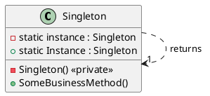
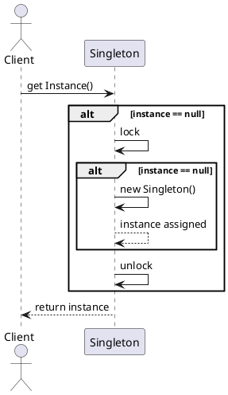

# Singleton (Одиночка)

## Уникальное название

**Singleton (Одиночка)**

---

## Описание решаемой проблемы

**Проблема:** требуется гарантировать существование ровно одного экземпляра класса в процессе (или в определённом домене видимости) и предоставить глобальную точку доступа к этому экземпляру.

**Когда возникает:**

* Нужно одно централизованное место хранения состояния (конфигурация, кэш, менеджер ресурсов).
* Нужен общий сервис с контролируемым временем жизни (логгер, менеджер подключения, пул ресурсов, менеджер настроек).
* Желание избежать создания множества тяжёлых объектов (например, expensive-to-create factory).

**Примеры задач:**

* Логгер: все компоненты приложения должны писать в один и тот же лог.
* Конфигурация приложения: единый источник настроек.
* Менеджер соединений/пулов: централизованное управление ресурсами.
* Кэш приложения: общая точка доступа к данным в памяти.

---

## Описание способа решения

Идея проста:

1. Закрыть доступ к конструктору класса (private ctor).
2. Хранить внутри класса статическое поле, которое содержит единственный экземпляр.
3. Предоставить публичный статический метод/свойство (напр., `Instance`), который возвращает этот экземпляр, создавая его при необходимости.

Ключевые вопросы при реализации:

* **Потокобезопасность:** создание единственного экземпляра в многопоточном окружении должно быть корректным.
* **Отложенная инициализация (lazy):** создавать объект только при первом обращении.
* **Сериализация/рефлексия:** защита от создания копий через сериализацию или отражение.
* **Тестируемость:** одиночка создаёт глобальное состояние и усложняет модульное тестирование — важно предусмотреть точки подмены/инъекции.

---

## Диаграмма и способ реализации

### UML  — диаграмма классов



### UML — последовательность (Sequence) создания экземпляра (lazy)



---

## Способы реализации на C#

### 1) Простейшая (непотокобезопасная)

```csharp
public sealed class SingletonSimple
{
    private static SingletonSimple _instance;
    private SingletonSimple() { }

    public static SingletonSimple Instance
    {
        get
        {
            if (_instance == null)
                _instance = new SingletonSimple();
            return _instance;
        }
    }

    public void DoWork() { /* ... */ }
}
```

**Когда подходит:** однопоточные приложения или когда гарантирована внешняя синхронизация. В многопоточных — **небезопасно**.

---

### 2) Thread-safe с lock (Double-check locking)

```csharp
public sealed class SingletonDoubleCheck
{
    private static SingletonDoubleCheck _instance;
    private static readonly object _sync = new object();
    private SingletonDoubleCheck() { }

    public static SingletonDoubleCheck Instance
    {
        get
        {
            // Быстрая проверка без захвата блокировки
            if (_instance == null)
            {
                lock (_sync)
                {
                    if (_instance == null)
                    {
                        _instance = new SingletonDoubleCheck();
                    }
                }
            }
            return _instance;
        }
    }

    public void DoWork() { /* ... */ }
}
```

**Пояснение:** двойная проверка уменьшает накладные расходы на lock после инициализации. В C# это корректно начиная с .NET 2.0 при использовании `volatile` или когда `_instance` — reference type и память упорядочена должным образом; безопаснее пометить поле `volatile`:

```csharp
private static volatile SingletonDoubleCheck _instance;
```

---

### 3) Использование статического конструктора (eager, thread-safe)

```csharp
public sealed class SingletonStatic
{
    private static readonly SingletonStatic _instance = new SingletonStatic();
    private SingletonStatic() { }

    public static SingletonStatic Instance => _instance;

    public void DoWork() { /* ... */ }
}
```

**Пояснение:** CLR гарантирует потокобезопасную инициализацию статических полей. Экземпляр создаётся при первом обращении к типу (или раньше — при загрузке типа), и дополнительные блокировки не нужны. Недостаток: экземпляр создаётся заранее (eager) — даже если никогда не используется.

---

### 4) Рекомендуемый современный способ — `Lazy<T>`

```csharp
public sealed class SingletonLazy
{
    private static readonly Lazy<SingletonLazy> _lazyInstance =
        new Lazy<SingletonLazy>(() => new SingletonLazy());

    private SingletonLazy() { }

    public static SingletonLazy Instance => _lazyInstance.Value;

    public void DoWork() { /* ... */ }
}
```

**Пояснение:** `Lazy<T>` предоставляет отложенную потокобезопасную инициализацию с контролем стратегии (`LazyThreadSafetyMode`). Это компактно и надёжно.

---

### 5) Защита от сериализации (чтобы не создавать новый объект при десериализации)

Если ваш Singleton сериализуем, десериализация по умолчанию создаст новый экземпляр. В .NET можно реализовать `ISerializable` и `IObjectReference`:

```csharp
[Serializable]
public sealed class SingletonSerializable : System.Runtime.Serialization.IObjectReference,
                                            System.Runtime.Serialization.ISerializable
{
    private static readonly SingletonSerializable _instance = new SingletonSerializable();
    private SingletonSerializable() { }

    public static SingletonSerializable Instance => _instance;

    // ISerializable
    void System.Runtime.Serialization.ISerializable.GetObjectData(
        System.Runtime.Serialization.SerializationInfo info,
        System.Runtime.Serialization.StreamingContext context)
    {
        // Нужен пустой набор данных — реализация использует GetRealObject
    }

    // IObjectReference
    public object GetRealObject(System.Runtime.Serialization.StreamingContext context)
    {
        // Возвращаем единственный экземпляр при десериализации
        return Instance;
    }
}
```

---

### 6) Защита от отражения (reflection)

Отражение может попытаться вызвать приватный конструктор. Частичная защита — бросать исключение, если уже существует экземпляр:

```csharp
public sealed class SingletonReflectionSafe
{
    private static bool _isInstanceCreated = false;
    private static readonly object _sync = new object();
    private SingletonReflectionSafe()
    {
        if (_isInstanceCreated)
            throw new InvalidOperationException("Singleton instance already created.");
        _isInstanceCreated = true;
    }

    private static readonly Lazy<SingletonReflectionSafe> _lazy =
        new Lazy<SingletonReflectionSafe>(() => new SingletonReflectionSafe());

    public static SingletonReflectionSafe Instance => _lazy.Value;
}
```

**Ограничение:** это не даёт 100%-ной защиты (рефлексия всё ещё может менять приватные поля/флаги), но затрудняет простое создание экземпляра.

---

## Плюсы и минусы, области применения, примеры

### Плюсы

* Гарантия единственного экземпляра и глобальная точка доступа.
* Контроль над временем инициализации (lazy/eager).
* Удобство для объектов, которыми должен пользоваться весь проект (логгер, кэш и т.д.).
* Простая реализация (несколько паттернов реализации).

### Минусы

* **Глобальное состояние** — Singleton вводит глобальное состояние, усложняя анализ и модульное тестирование (тесты могут влиять друг на друга).
* **Скрытые зависимости** — код зависящий от `Singleton.Instance` получает скрытую зависимость (сложно подменить при тестировании).
* **Проблемы с жизненным циклом** — сложно контролировать время уничтожения/очистки ресурсов (особенно в больших приложениях, плагинах).
* **Проблемы с загрузкой/пулы приложений** (например, в средах с несколькими доменами приложения или при hot-reload).
* Неправильная реализация может привести к **гонкам** и **condition race**.
* Может стать «анти-шаблоном», если используется вместо явной инверсии зависимостей (Dependency Injection).

### Области применения (когда хороший выбор)

* Легковесные глобальные сервисы: логгеры, провайдеры конфигурации, провайдеры метрик.
* Объекты, чья семантика действительно подразумевает единственность в пределах процесса.
* Legacy-код, где внедрение DI затруднено.

### Когда **не** следует использовать

* Когда важна тестируемость и удобство замены зависимостей — лучше использовать Dependency Injection.
* Когда нужно несколько экземпляров в разных контекстах/скопах (например, per-request).
* Когда состояние можно локализовать — глобальное состояние повышает слияние ответственности.

### Практические примеры

* Логгер (`Logger.Instance.Log("...")`)
* Менеджер конфигурации (`ConfigurationManager.Instance.Get("...")`)
* Централизованный кэш (`Cache.Instance`)
* Фабрика ресурсов в приложении, где ресурс должен быть уникален

---

## Советы по использованию в реальном проекте

1. **Предпочитайте DI**: если проект использует контейнер зависимостей (DI), зарегистрируйте сервис как singleton / single instance в контейнере — это даёт явную конфигурацию и упрощает тестирование.
2. **Документируйте** почему класс — одиночка и зачем нужен. Это снижает злоупотребления.
3. **Минимизируйте состояние** в одиночках. Лучше, если Singleton предоставляет сервисы без большого внутреннего изменяемого состояния.
4. **Используйте `Lazy<T>`** для компактной и правильной ленивой инициализации.
5. **Защищайте сериализацию/рефлексию**, если предполагается сериализация экземпляра и безопасность от создания дополнительных экземпляров.

---

## Краткая сравнительная таблица реализаций (C#)

| Подход                | Потокобезопасность |      Ленивость | Простота | Рекомендация                               |
| --------------------- | -----------------: | -------------: | -------: | ------------------------------------------ |
| Простая (без lock)    |                  ❌ |              ✅ |        ✓ | Только для однопоточного                   |
| `lock` (double-check) |                  ✅ |              ✅ |  средняя | Хорошо, но более многословно               |
| Статическое поле      |            ✅ (CLR) | нет/опережающе |        ✓ | Простая и надёжная для большинства случаев |
| `Lazy<T>`             |                  ✅ |              ✅ |        ✓ | Современный и рекомендованный способ       |

---
Ниже приведён **наглядный пример**, показывающий:
1️⃣ как **Singleton может привести к проблемам** (жёсткие зависимости, трудное тестирование, нарушение принципа инверсии зависимостей),
2️⃣ и как **рефакторинг с использованием Dependency Injection (DI)** решает эти проблемы.

---

# ❌ Плохой пример: использование Singleton напрямую

```csharp
using System;

public sealed class Logger
{
    private static readonly Logger _instance = new Logger();
    private Logger() { }

    public static Logger Instance => _instance;

    public void Log(string message)
    {
        Console.WriteLine($"[{DateTime.Now:HH:mm:ss}] {message}");
    }
}

// Сервис бизнес-логики
public class OrderService
{
    public void PlaceOrder(string product)
    {
        Logger.Instance.Log($"Начало оформления заказа: {product}");
        // ... бизнес-логика ...
        Logger.Instance.Log($"Заказ успешно оформлен: {product}");
    }
}

// Тестирование
public class Program
{
    public static void Main()
    {
        var service = new OrderService();
        service.PlaceOrder("Notebook");
    }
}
```

### 🚨 Проблемы такого подхода

| Проблема                     | Описание                                                                                                                                                       |
| ---------------------------- | -------------------------------------------------------------------------------------------------------------------------------------------------------------- |
| 🔒 Жёсткая зависимость       | `OrderService` *жёстко привязан* к `Logger.Instance` и не может работать без него.                                                                             |
| 🧪 Невозможно протестировать | В тестах нельзя подменить логгер, чтобы, например, не выводить в консоль, а сохранять в память.                                                                |
| ♻️ Глобальное состояние      | Логгер доступен отовсюду, что повышает риск нежелательного взаимодействия модулей.                                                                             |
| 🧩 Нарушение SOLID           | Нарушается **Dependency Inversion Principle (DIP)** — высокоуровневый модуль (`OrderService`) зависит от конкретной реализации (`Logger`), а не от абстракции. |
| 🚫 Плохая расширяемость      | Добавить, например, логирование в файл или удалённый сервер — трудно, всё придётся менять вручную.                                                             |

---

# ✅ Рефакторинг: через Dependency Injection (DI)

## 1. Вводим интерфейс логгера

```csharp
public interface ILogger
{
    void Log(string message);
}
```

## 2. Реализация логгера (теперь это просто обычный класс)

```csharp
public class ConsoleLogger : ILogger
{
    public void Log(string message)
    {
        Console.WriteLine($"[{DateTime.Now:HH:mm:ss}] {message}");
    }
}
```

## 3. Класс бизнес-логики теперь получает зависимость через конструктор

```csharp
public class OrderService
{
    private readonly ILogger _logger;

    public OrderService(ILogger logger)
    {
        _logger = logger;
    }

    public void PlaceOrder(string product)
    {
        _logger.Log($"Начало оформления заказа: {product}");
        // ... бизнес-логика ...
        _logger.Log($"Заказ успешно оформлен: {product}");
    }
}
```

## 4. Приложение (композиция зависимостей)

```csharp
public class Program
{
    public static void Main()
    {
        ILogger logger = new ConsoleLogger();
        var service = new OrderService(logger);

        service.PlaceOrder("Notebook");
    }
}
```

---

# 🧪 Теперь тестировать легко

```csharp
using System.Collections.Generic;

public class FakeLogger : ILogger
{
    public List<string> Messages { get; } = new List<string>();
    public void Log(string message) => Messages.Add(message);
}

public class OrderServiceTests
{
    public void Test_OrderLogging()
    {
        var fakeLogger = new FakeLogger();
        var service = new OrderService(fakeLogger);

        service.PlaceOrder("TestProduct");

        // Проверяем, что логирование работает
        if (fakeLogger.Messages.Count != 2)
            throw new Exception("Logging failed!");

        Console.WriteLine("✅ Тест прошёл успешно");
    }
}

public static class TestRunner
{
    public static void Main()
    {
        new OrderServiceTests().Test_OrderLogging();
    }
}
```

---

# 💡 Что мы выиграли

| Было (Singleton)          | Стало (DI)                                                                       |
| ------------------------- | -------------------------------------------------------------------------------- |
| Глобальное состояние      | Нет глобального состояния                                                        |
| Жёсткая зависимость       | Зависимость через интерфейс                                                      |
| Невозможно протестировать | Можно подменить `ILogger`                                                        |
| Нарушен DIP               | DIP соблюдён                                                                     |
| Сложно расширять          | Можно добавлять новые типы логгеров (файл, база, REST) без изменения бизнес-кода |

---

# 🌐 Использование DI-контейнера (пример с Microsoft.Extensions.DependencyInjection)

```csharp
using Microsoft.Extensions.DependencyInjection;

var services = new ServiceCollection();
services.AddSingleton<ILogger, ConsoleLogger>();
services.AddTransient<OrderService>();

var provider = services.BuildServiceProvider();
var orderService = provider.GetRequiredService<OrderService>();

orderService.PlaceOrder("Laptop");
```

**Пояснение:**

* `AddSingleton<ILogger, ConsoleLogger>()` — создаёт единственный экземпляр логгера (аналог Singleton, но управляемый DI-контейнером).
* `AddTransient<OrderService>()` — создаёт новый экземпляр сервиса при каждом запросе.
* DI-контейнер берёт на себя управление зависимостями и временем жизни.

---

# 🧭 Вывод

| Подход                   | Когда использовать                                                                                                                                                |
| ------------------------ | ----------------------------------------------------------------------------------------------------------------------------------------------------------------- |
| **Singleton**            | Когда действительно требуется ровно один объект, и он не должен зависеть от контекста (например, доступ к системным API, low-level logging, объект конфигурации). |
| **Dependency Injection** | Когда важны тестируемость, расширяемость и модульность. Предпочтительный способ для большинства приложений.                                                       |

---

## Заключение

Singleton решает конкретную и простую задачу — единственность экземпляра и глобальная точка доступа. При правильной реализации (потокобезопасной и с учётом сериализации/рефлексии) он полезен, но обладает побочными эффектами: глобальное состояние, снижение тестируемости и скрытые зависимости. В современных приложениях часто лучше — использовать контейнеры зависимости и регистрировать службы как одиночки в DI-контейнере, сохраняя при этом преимущества управления временем жизни и облегчая тестирование.

---


